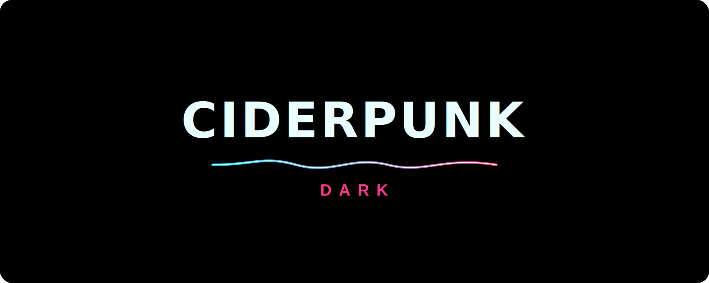
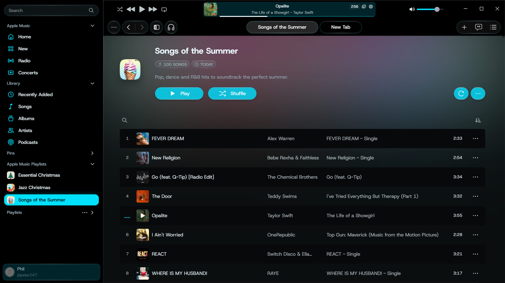
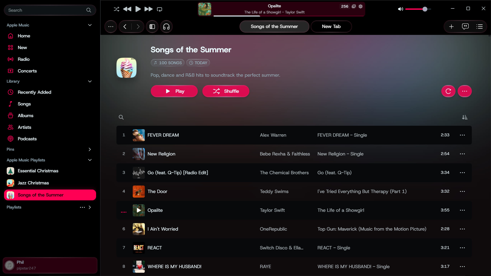
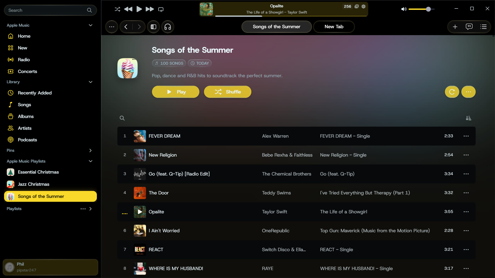
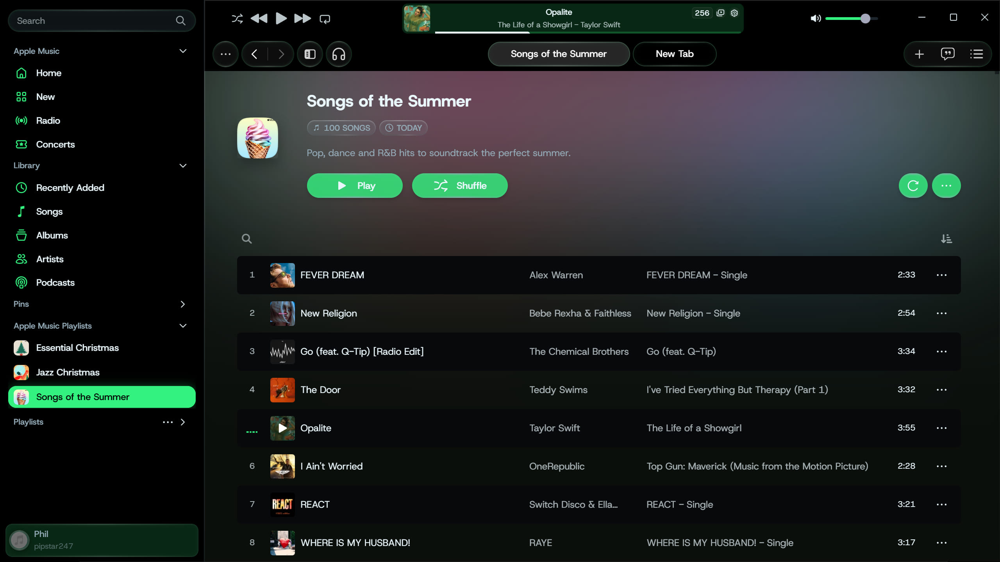
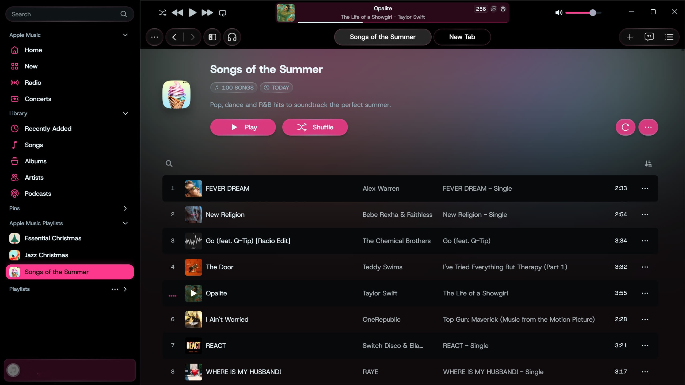
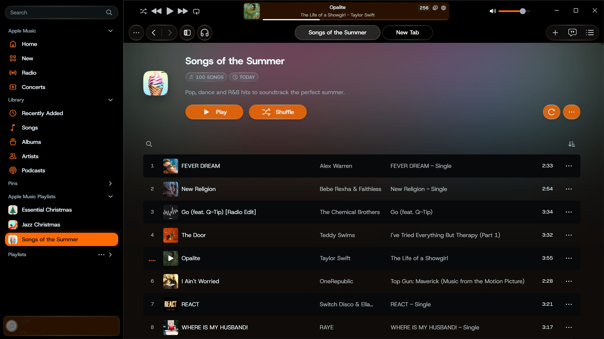
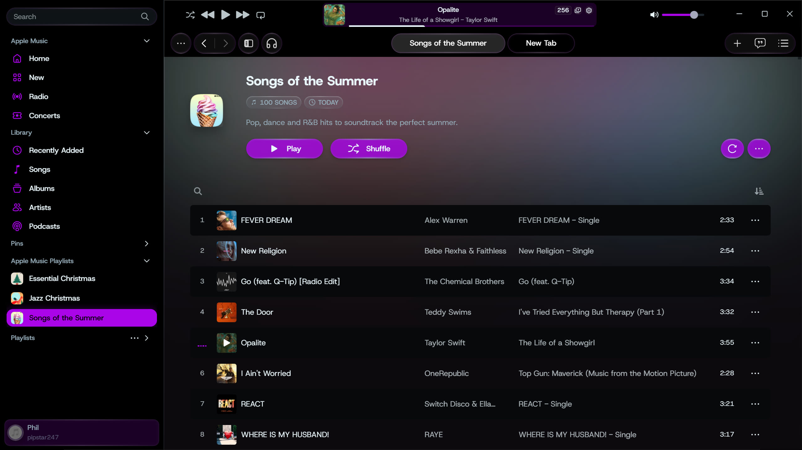
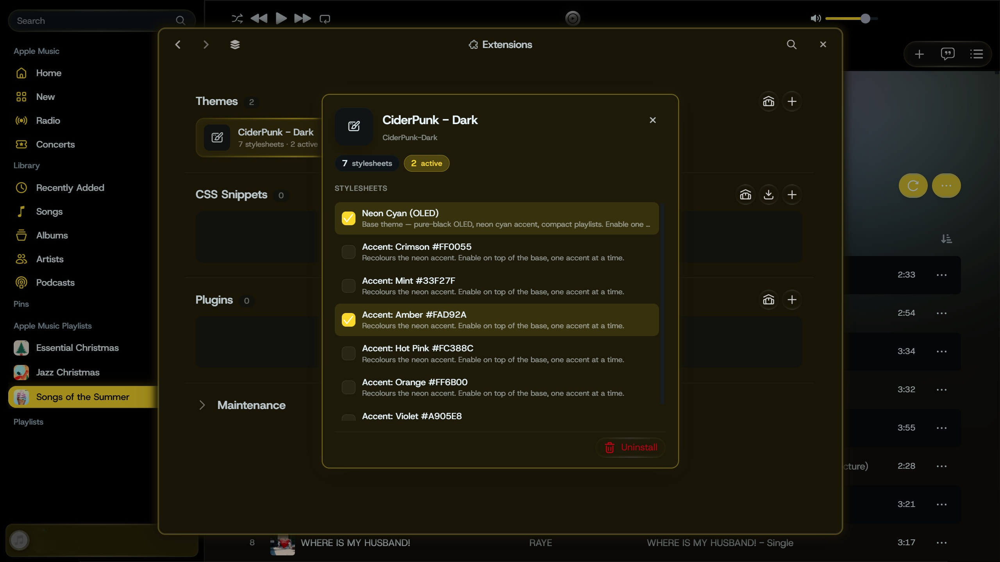

# CiderPunk — Dark

A pure-black **OLED** theme for [Cider](https://cider.sh) with a **neon cyberpunk** accent and a tightened, information-dense layout. Cyan by default, with six more neon accents you can switch in one click.

> App icon / tile: `assets/logo.svg` (SVG) and `assets/logo-512.png` / `assets/logo-1024.png` (raster).

---

## Features

- **True-black OLED** backgrounds across the chrome, sidebar, content, drawers, dialogs, immersive mode, and menus — easy on the eyes and on OLED panels.
- **Neon accent with a glow signature** on the things that should pop: the active sidebar item, the active lyric line, progress bars, and the queue/lyrics toggles.
- **Seven accents**, switchable from the theme settings without reinstalling — the glow and selection highlight recolour with the accent.
- **Compact playlists** — both the track rows *and* the header/banner are slimmed down, so the song list starts higher and shows far more at a glance.
- **Themed end-to-end** — context menus, settings window, command center, library pages, the in-app marketplace gallery, and Windows window controls.
- Built on Cider's stable `[sfc-name]` hooks and a single token block, so it's easy to fork and retune.

## Accents

| Accent | Hex |
|---|---|
| Neon Cyan (default, base) | `#00E0FF` |
| Crimson | `#FF0055` |
| Mint | `#33F27F` |
| Amber | `#FAD92A` |
| Hot Pink | `#FC388C` |
| Orange | `#FF6B00` |
| Violet | `#A905E8` |

## Gallery

---

## Install

**From inside Cider (recommended)**
1. Cider → **Settings → Extensions** (Manage Styles).
2. **Explore GitHub Themes → Install from GitHub URL**, and paste this repository's URL.
3. Enable **Neon Cyan (OLED)**, then optionally enable **one** accent on top of it.
4. Set Cider's appearance to **Dark** — the theme is scoped to the dark color scheme.

**Manual**
1. Open Cider's themes folder (Extensions → Maintenance → *Open AppData folder*; on the
   Microsoft Store build the real path is
   `…\Packages\CiderCollective.Cider_*\LocalCache\Roaming\sh.cider.dotnet\themes\`).
2. Copy this folder in, then **Extensions → Maintenance → Refresh extensions**.

### Switching accents
The accents are stacked styles, not separate themes. Keep **Neon Cyan (OLED)** enabled as
the base and *also* enable one `Accent: …` style. Enabling more than one applies the last
one; disable the accent to return to cyan.

> Requires the dark color scheme. With **Enable theme file watcher** on, edits hot-reload.

---

## Credits & license

CiderPunk - Dark is MIT-licensed. It was built against Cider 4's DOM using the
[Catppuccin for Cider](https://github.com/catppuccin/cider) theme as a structural reference
for selectors, and is named in the lineage of the original
[Better Cider Theme](https://github.com/Nevodev/Better-Cider-Theme) by Nevoit. Both are
MIT-licensed; their notices are preserved in [LICENSE](LICENSE).
